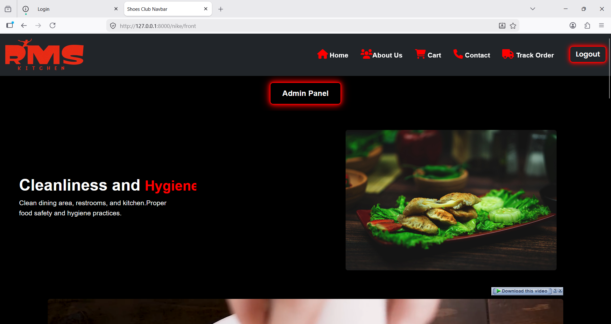
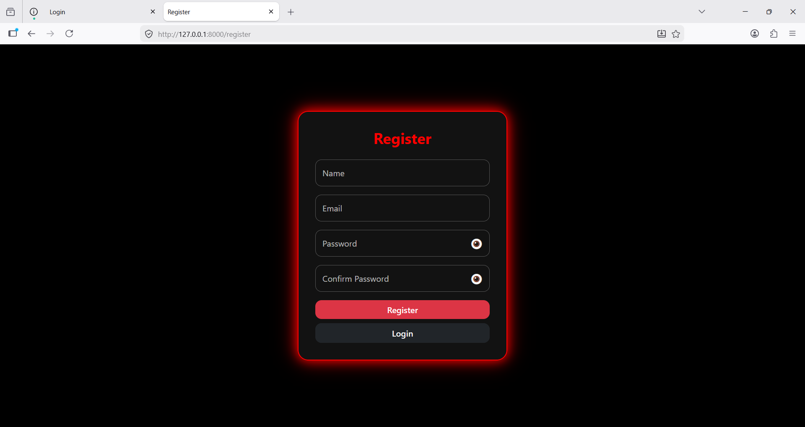
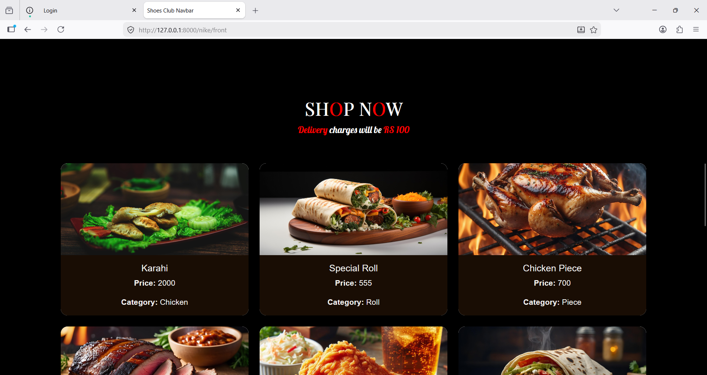
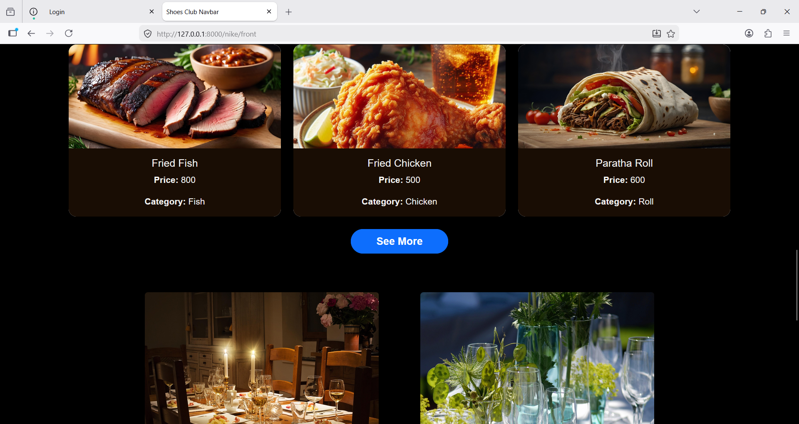
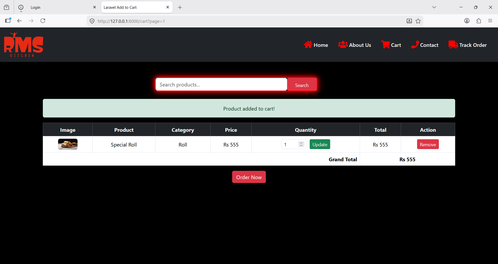
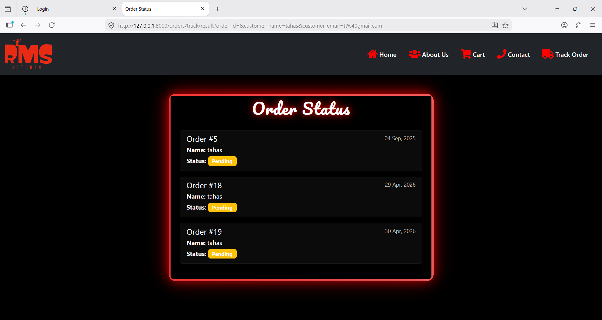
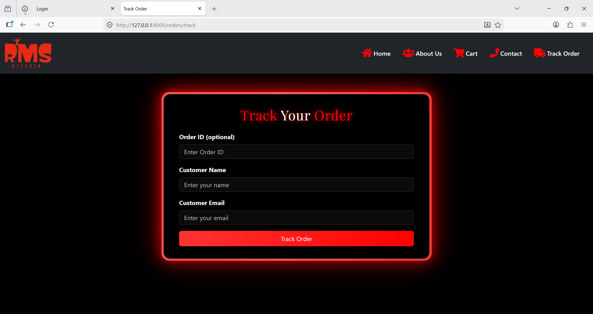
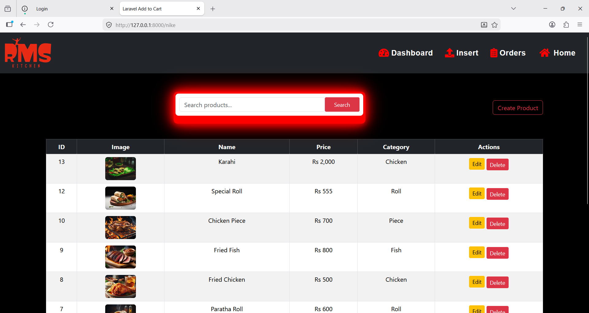
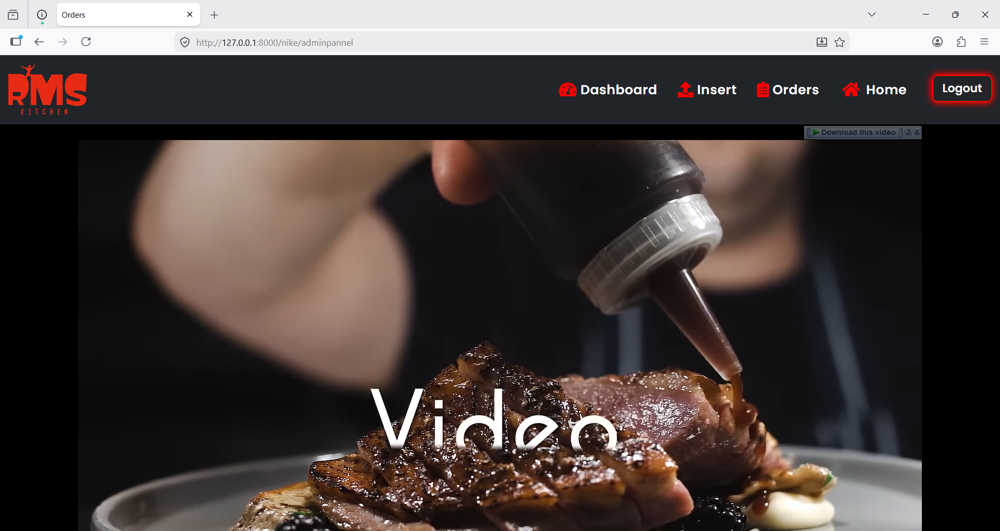

# 🍽️ Restaurant Management System

A modern **Full Stack Restaurant Management System** developed using **Laravel, PHP, MySQL, Bootstrap 5, Blade, and JavaScript** featuring responsive interfaces, interactive animations, authentication workflows, and restaurant operations management.

---

## 🚀 Project Overview

This project was developed to simplify restaurant operations through a scalable full-stack architecture and responsive user experience.

The system manages menus, products, customer interaction, orders, checkout processing, and administrative workflows.

---

## 🛠️ Tech Stack

### Backend
- Laravel Framework
- PHP 8.x
- MVC Architecture

### Database
- MySQL
- Relational Database Design

### Frontend
- Bootstrap 5
- Blade Template Engine
- JavaScript
- Responsive UI

### Development Tools
- Git
- GitHub
- Postman
- XAMPP

---

## ✨ Core Features

### Authentication
- User Registration
- Secure Login System
- Session Management

### Restaurant Operations
- Dynamic Menu Management
- Product Management
- Responsive Customer Interface

### Order Workflow
- Add to Cart
- Checkout System
- Order Placement
- Order Tracking

### Admin Controls
- Dashboard Analytics
- Order Management
- System Monitoring

### User Experience
- Responsive Layout
- Interactive JavaScript Animations
- Modern UI Design
- Smooth Navigation

---

# 📷 Application Screenshots

## 🏠 Home Page

---

## 📝 Registration Page

---

## 🍽️ Menu Interface

---

## 📦 Products Page

---

## 🛒 Cart System

---

## 💳 Checkout Page

---

## 📍 Order Tracking

---

## 📋 Orders Management

---

## 📊 Dashboard

---

## 📂 Project Highlights

- Full Stack Architecture  
- Responsive Web Design  
- Interactive JavaScript Animations  
- Scalable Database Structure  
- Dynamic Restaurant Workflow  
- Clean User Experience  

---

## 👨‍💻 Developer

**Talha Zeeshan**  
Full Stack Web Developer  

GitHub:  
https://github.com/TalhaZeeshan-FullStackDeveloper

---

⭐ If you found this project useful, consider giving it a star.
